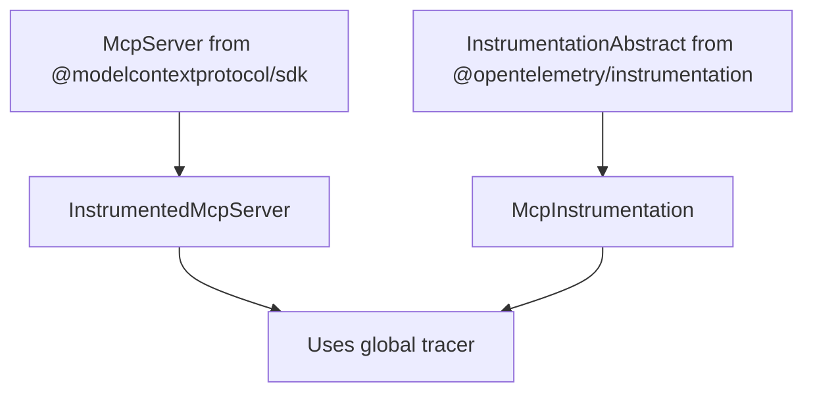

# MCP-OTel Architecture

## Overview

`mcp-otel` provides OpenTelemetry instrumentation for MCP servers in a transport-agnostic way. It follows OpenTelemetry best practices by:

1. **Not creating its own providers** - Uses the global OpenTelemetry API
2. **Not configuring exporters** - Leaves this to the host application
3. **Supporting any transport** - Works with Node.js, Cloudflare Workers, browsers, etc.
4. **Propagating context** - Participates in existing trace contexts

## Core Design Principles

### 1. Use Global OpenTelemetry API

```typescript
import { trace, context, SpanKind } from '@opentelemetry/api';

// Get tracer from global registry
const tracer = trace.getTracer('@axiom/mcp-otel', VERSION);
```

### 2. No Provider Setup

The library NEVER:
- Creates `BasicTracerProvider`, `NodeSDK`, or any provider
- Configures exporters (Console, OTLP, etc.)
- Registers providers globally
- Manages provider lifecycle

### 3. Context Propagation

Always use the global context API to ensure spans are part of the parent trace:

```typescript
context.with(trace.setSpan(context.active(), span), async () => {
  // Instrumented code runs in the span's context
});
```

## Architecture

### Core Components

```
mcp-otel/
├── src/
│   ├── instrumentation.ts    # McpInstrumentation extends InstrumentationAbstract
│   ├── instrumented-server.ts # InstrumentedMcpServer extends McpServer
│   └── index.ts              # Public API exports
```

### Class Hierarchy



## Implementation

### InstrumentedMcpServer

```typescript
export class InstrumentedMcpServer extends McpServer {
  private tracer: Tracer;
  
  constructor(
    serverInfo: { name: string; version: string },
    options?: {
      instrumentationName?: string;
      instrumentationVersion?: string;
    }
  ) {
    super(serverInfo);
    
    // Get tracer from global registry
    this.tracer = trace.getTracer(
      options?.instrumentationName || '@axiom/mcp-otel',
      options?.instrumentationVersion || VERSION
    );
  }
  
  // Override methods to add instrumentation
  tool(name: string, ...args: any[]): any {
    // Wrap callback with tracing
  }
}
```

### McpInstrumentation (Optional)

For applications that use the OpenTelemetry instrumentation pattern:

```typescript
export class McpInstrumentation extends InstrumentationAbstract {
  constructor(config: InstrumentationConfig = {}) {
    super('@axiom/mcp-otel', VERSION, config);
  }
  
  protected init() {
    // Return the instrumented server class
    return InstrumentedMcpServer;
  }
  
  enable() {
    // Enable instrumentation
  }
  
  disable() {
    // Disable instrumentation
  }
}
```

## Usage Patterns

### 1. Node.js Application

```typescript
import { NodeSDK } from '@opentelemetry/sdk-node';
import { OTLPTraceExporter } from '@opentelemetry/exporter-trace-otlp-http';
import { InstrumentedMcpServer } from 'mcp-otel';

// Application sets up OpenTelemetry
const sdk = new NodeSDK({
  traceExporter: new OTLPTraceExporter({
    url: 'http://localhost:4318/v1/traces'
  })
});

sdk.start();

// Use instrumented server - it uses the global tracer
const server = new InstrumentedMcpServer({
  name: 'my-server',
  version: '1.0.0'
});
```

### 2. Cloudflare Workers

```typescript
import { trace } from '@opentelemetry/api';
import { instrument, ResolveConfigFn } from '@microlabs/otel-cf-workers';
import { InstrumentedMcpServer } from 'mcp-otel';

const config: ResolveConfigFn = (env) => ({
  exporter: { url: 'https://api.axiom.co/v1/traces' },
  service: { name: 'mcp-worker' }
});

export default instrument(
  {
    async fetch(request, env, ctx) {
      // Cloudflare Workers sets up the tracer per request
      const server = new InstrumentedMcpServer({
        name: 'worker-mcp',
        version: '1.0.0'
      });
      
      // Handle request...
    }
  },
  config
);
```

### 3. Next.js Application

```typescript
// In instrumentation.ts
import { registerOTel } from '@vercel/otel';
import { InstrumentedMcpServer } from 'mcp-otel';

export function register() {
  registerOTel({ serviceName: 'next-mcp-app' });
}

// In API route
export async function POST(req: Request) {
  const server = new InstrumentedMcpServer({
    name: 'next-mcp',
    version: '1.0.0'
  });
  
  // Handle request...
}
```

## Benefits

1. **Framework Agnostic**: Works with any OpenTelemetry setup
2. **No Lock-in**: Applications control their telemetry pipeline
3. **Proper Context**: Spans are part of the application's trace context
4. **Simple Integration**: Just replace `McpServer` with `InstrumentedMcpServer`
5. **Standard Pattern**: Follows OpenTelemetry instrumentation best practices